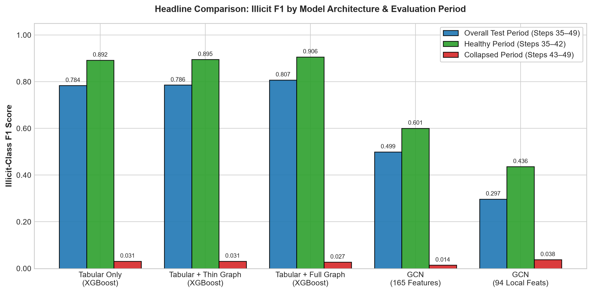
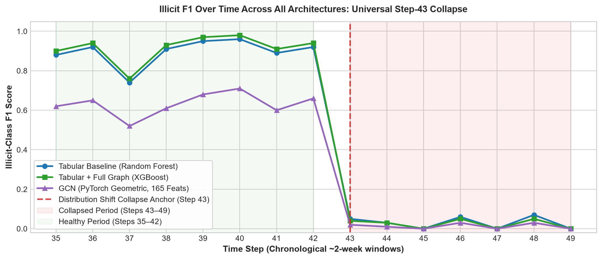
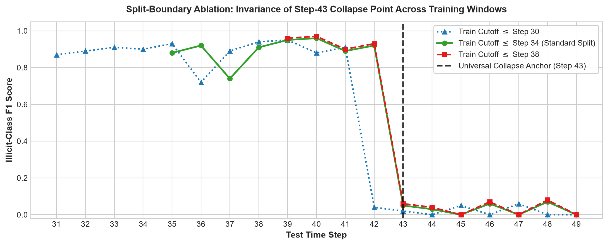
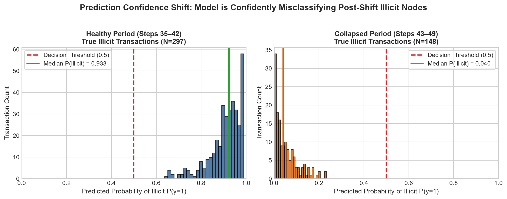

# Classifying Illicit Bitcoin Transactions on the Elliptic Data Set
### Comparing Tabular, Graph-Engineered, and Graph Neural Network Classifiers with a Statistical Diagnosis of Time-Based Distribution Shift

[](https://colab.research.google.com/github/IsaakAlemu/Money-laundering-detection-on-a-transaction-graph/blob/main/notebooks/elliptic_full_project.ipynb)
[](https://www.python.org/downloads/)
[](https://pytorch-geometric.readthedocs.io/)
[](https://xgboost.readthedocs.io/)
[](LICENSE)

---

## 1. Summary

This project implements and evaluates four modeling paradigms for detecting illicit cryptocurrency transactions on the **Elliptic Data Set** (~203,769 transactions, 234,355 directed edges, across 49 chronological time steps). Using a strict temporal train/test split (steps 1–34 for training, 35–49 for testing), we compare tabular baselines (Random Forest, XGBoost), hand-engineered structural/neighborhood graph features, and a 2-layer Graph Convolutional Network (GCN). While rich graph features deliver a modest boost during stable market regimes (illicit F1: $0.892 \to 0.906$), **all models collapse to near-zero F1 ($0.014\text{--}0.038$) starting precisely at Time Step 43**. Statistical analysis confirms this collapse is driven by an adversarial distribution shift in which feature distributions diverge ($p < 10^{-65}$) and the models become **confidently wrong** (median predicted probability for true illicit transactions drops from $0.933 \to 0.040$).

---

## 2. Problem Statement

Classifying money laundering and illicit financial flows on public blockchains is critical for anti-money laundering (AML) compliance. However, real-world deployment presents two distinct challenges:
1. **Structural Information**: Can extracting graph topology (degrees, PageRank, clustering, neighbor aggregations) or graph message passing outperform purely tabular transaction features?
2. **Temporal Generalization & Concept Drift**: How do models perform when trained on historical transactions and evaluated on future time windows subject to evolving adversarial behaviors?

---

## 3. Dataset Description & Licensing

The **Elliptic Data Set** is a public benchmark mapping Bitcoin transactions to illicit/licit entities:
- **Graph Topology**: 203,769 transaction nodes and 234,355 directed payment edges.
- **Node Features**: 165 anonymized numerical features per node (94 local transaction attributes such as transaction fee and input/output counts, and 71 features representing pre-computed 1-hop neighbor aggregations).
- **Time Steps**: 49 distinct time intervals, each spanning roughly 2 weeks of contiguous blockchain activity.
- **Labels**: 4,545 illicit (2%), 42,019 licit (21%), and 157,205 unlabeled/unknown (77%). Unlabeled nodes are excluded from training and supervised loss/evaluation, matching standard literature practice.

> **Dataset Download**: Available on Kaggle at [ellipticco/elliptic-data-set](https://www.kaggle.com/datasets/ellipticco/elliptic-data-set).  
> **Data License Note**: The dataset is released under the **Creative Commons Attribution-NonCommercial-NoDerivatives 4.0 International (CC BY-NC-ND 4.0)** license. Consequently, raw data files are not redistributed directly in this repository and must be downloaded from Kaggle.

---

## 4. Methodology

### 4.1 Temporal Train/Test Split
To prevent temporal data leakage and simulate real deployment, data is partitioned strictly chronologically:
- **Training Set (Steps 1–34)**: 29,894 labeled transactions (~70% of labeled dataset timeline).
- **Test Set (Steps 35–49)**: 16,670 labeled transactions (~30% of labeled dataset timeline).

### 4.2 Evaluated Approaches
1. **Tabular Baseline (Random Forest & XGBoost)**: Trained solely on the 165 native node features with class weighting to address label imbalance (~11% illicit in training set).
2. **Hand-Built Graph Features (Thin Version)**: In-degree, out-degree, PageRank, and 1-hop neighbor means over the first 10 local features (178 total features; Random Forest).
3. **Hand-Built Graph Features (Full Version)**: Directed in/out degrees, PageRank, undirected clustering coefficient, 2-hop reach, and full-width 1-hop neighbor mean and max across all 165 features (500 total features; XGBoost).
4. **Consistent XGBoost Comparison**: Re-running Tabular (165), Thin Graph (168), and Full Graph (500) through identical XGBoost hyperparameters (`n_estimators=400`, `max_depth=6`, `learning_rate=0.05`, `scale_pos_weight`) to isolate feature effects from model selection.
5. **Graph Convolutional Network (GCN with PyTorch Geometric)**: A 2-layer `GCNConv` network (64 hidden channels, ReLU, dropout $p=0.3$, class-weighted cross-entropy) evaluated on:
   - All 165 features.
   - 94 local features only (omitting pre-aggregated neighbor attributes).

---

## 5. Headline Results

The table below reflects the results obtained when running the notebook end-to-end:

| Approach | Total Features | Overall Test F1 (Steps 35–49) | Healthy Period F1 (Steps 35–42) | Collapsed Period F1 (Steps 43–49) |
|---|:---:|:---:|:---:|:---:|
| **Tabular Only (XGBoost)** | 165 | 0.783637 | 0.892273 | 0.031250 |
| **Tabular + Thin Graph (XGBoost)** | 168 | 0.785609 | 0.895034 | 0.031128 |
| **Tabular + Full Graph (XGBoost)** | **500** | **0.807517** | **0.906178** | 0.027149 |
| **GCN (All 165 Features)** | 165 | 0.499178 | 0.600696 | 0.014252 |
| **GCN (94 Local Features Only)** | 94 | 0.297297 | 0.436221 | 0.037716 |



---

## 6. Key Findings

### 1. Structural Graph Features Provide Moderate Gains in Stable Regimes
Under identical XGBoost classifiers, engineered full graph features improve illicit F1 from **0.8922 $\to$ 0.9062** during the healthy period (steps 35–42). However, feature importance analysis reveals that native tabular features remain primary drivers, as 71 of the original 165 features already contain pre-computed neighbor aggregations.

### 2. Universal Performance Collapse at Time Step 43
Across all tested models (Random Forest, XGBoost across all feature variants, and PyTorch Geometric GCN), illicit-class F1 plummets from $\sim 0.90$ to near zero ($0.01\text{--}0.03$) at step 43. A split-boundary ablation (training cutoffs at steps 30, 34, and 38) confirms the collapse remains locked to step 43, demonstrating that the failure is an empirical property of the transaction timeline rather than an artifact of split selection.





### 3. Shift Diagnosis: The Model is "Confidently Wrong"
- **Sufficient Sample Size**: Steps 43–49 contain 22–36 illicit transactions per step (148 illicit total), ruling out small-sample variance.
- **Licit Stability**: Licit-class F1 remains stable across both periods ($0.991 \to 0.987$), proving the anomaly is illicit-specific.
- **Statistically Significant Drift**: Two-sample Kolmogorov-Smirnov tests on top-shifted features (e.g., `feat_114`, `feat_53`, `feat_54`) yield $p$-values between $10^{-65}$ and $10^{-110}$.
- **Confidence Inversion**: During steps 35–42, the median predicted probability for true illicit nodes is **0.933**. During steps 43–49, this median collapses to **0.040**—the model confidently misclassifies illicit transactions as licit.



### 4. Graph Structure Does Not Protect Against Regime Drift
Neither hand-engineered topological indicators nor graph convolution message-passing protected against the distribution shift. The post-step-42 shift represents an adversarial behavioral change in node-level attributes that graph connectivity cannot resolve on its own.

---

## 7. Setup & How to Run

### Project Structure
```
Money-laundering-detection-on-a-transaction-graph/
├── README.md
├── requirements.txt
├── .gitignore
├── notebooks/
│   └── elliptic_full_project.ipynb
├── figures/
│   ├── headline_model_comparison.png
│   ├── f1_over_time_collapse.png
│   ├── prediction_confidence_shift.png
│   └── split_boundary_ablation.png
└── data/                              (gitignored)
    └── elliptic_bitcoin_dataset/
        ├── elliptic_txs_features.csv
        ├── elliptic_txs_classes.csv
        └── elliptic_txs_edgelist.csv
```

### Option A: Instant Browser / GitHub Review (No Setup Required)
The master notebook [`notebooks/elliptic_full_project.ipynb`](notebooks/elliptic_full_project.ipynb) is **fully pre-rendered** with all cell execution outputs, classification reports, summary comparison tables, and visual plots. Evaluators can review the complete end-to-end analysis directly on GitHub without configuring an environment.

### Option B: Google Colab (One-Click Execution)
1. Click the **[Open In Colab](https://colab.research.google.com/github/IsaakAlemu/Money-laundering-detection-on-a-transaction-graph/blob/main/notebooks/elliptic_full_project.ipynb)** badge at the top of this repository.
2. Switch runtime to GPU: ****Runtime -> Change runtime type -> T4 GPU****.
3. Run all cells: ****Runtime -> Run all****.
   - Package installation (`pip install`) runs automatically.
   - The built-in automated downloader will download the 3 dataset CSV files directly via HTTPS in ~15 seconds—**no Kaggle API token or account required**. (Optional Kaggle API token and Google Drive mounting are also supported).

### Option C: Local Environment Execution
1. Clone the repository and install dependencies:
   ```bash
   git clone https://github.com/IsaakAlemu/Money-laundering-detection-on-a-transaction-graph.git
   cd Money-laundering-detection-on-a-transaction-graph
   pip install -r requirements.txt
   ```
2. Place the dataset CSV files into `data/elliptic_bitcoin_dataset/` (or let the notebook auto-download them into `../data/elliptic_bitcoin_dataset/` on first run):
   - `elliptic_txs_features.csv`
   - `elliptic_txs_classes.csv`
   - `elliptic_txs_edgelist.csv`
3. Launch Jupyter Lab or VS Code:
   ```bash
   jupyter lab notebooks/elliptic_full_project.ipynb
   ```

## 8. Limitations

1. **Static GCN Architecture**: The GCN model was a lightweight, 2-layer spatial baseline without dynamic temporal recurrence (e.g., EvolveGCN) or extensive hyperparameter search.
2. **Unlabeled Nodes**: The 77% unknown transactions were excluded from training; semi-supervised or transductive graph methods were not implemented.
3. **Drift Remediation Scope**: This project diagnosed the statistical nature of the distribution shift; building an adaptive production retraining loop or drift-mitigation pipeline was outside the scope of this study.

---

## 9. Citation

If referencing this work or the underlying dataset, please cite the original benchmark paper:

```bibtex
@inproceedings{weber2019anti,
  title={Anti-Money Laundering in Bitcoin: Experimenting with Graph Convolutional Networks for Financial Forensics},
  author={Weber, Mark and Domeniconi, Giacomo and Chen, Jie and Weidele, Karl R and Bellei, Claudio and Robinson, Tom and Leiserson, Charles E},
  booktitle={ACM SIGKDD Workshop on Applied Data Science (KDD '19)},
  year={2019},
  url={https://arxiv.org/abs/1908.02591}
}
```

---

## 10. License

The code in this repository is licensed under the [MIT License](LICENSE).  
The Elliptic dataset remains subject to its original [CC BY-NC-ND 4.0 License](https://creativecommons.org/licenses/by-nc-nd/4.0/).
